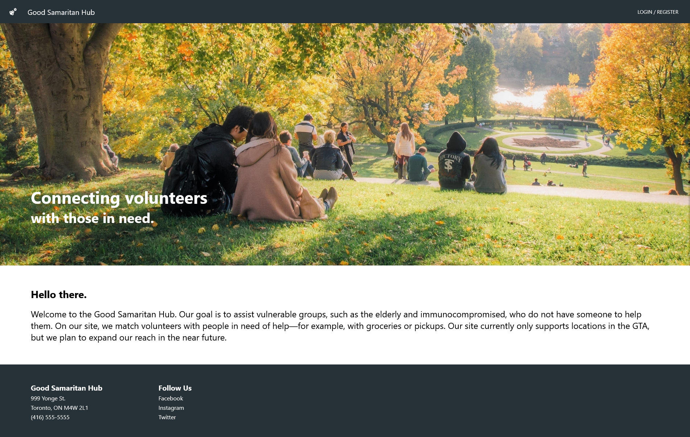
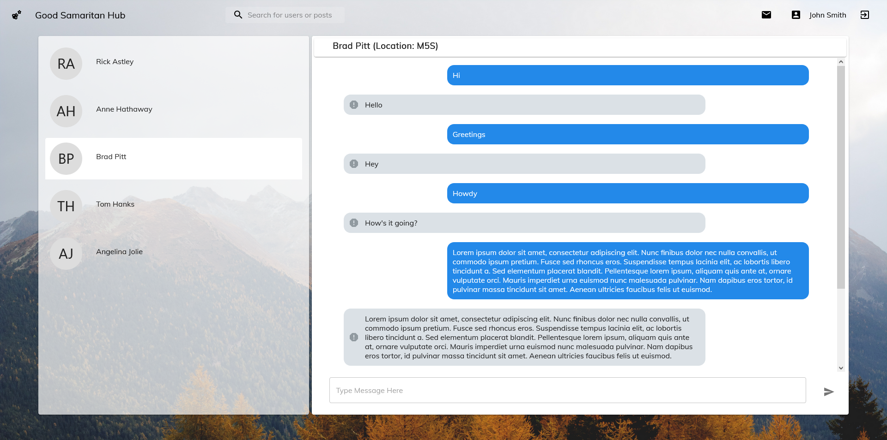
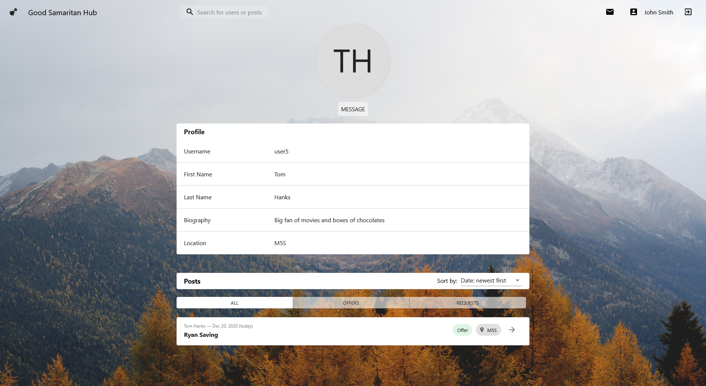

# Our React App: The Good Samaritan Hub

The Good Samaritan Hub is a web app built using MongoDB, Express, React, Node.js (MERN) that enables volunteers and voluntees to find each other. People are able to sign up, make posts (requests/offers), and chat with other members Made as part of group project along with Jeremy Hsu, Ashley Lu, and Irina Li.

## Link to App
https://hidden-fjord-63319.herokuapp.com/


## Screenshots

#### Homepage


#### Logged In Homepage


#### Profile


#### Messaging


####

## Instructions to Run (If needed)

Start a local Mongo database:

```
mkdir mongo-data
mongod --dbpath mongo-data
```

Clone the github repository by running the following:  
`git clone https://github.com/hrithikshukla/Good-Samaritan-Hub.git`

Then navigate to `/Good-Samaritan-Hub/` and run the following:   
`cd client && npm install && npm run build && cd ../server && npm install && npm start`

Now open up your browser and go to `localhost:5000`

## Instructions to Use
### User
#### Login Credentials:
username: `user`  
password: `user`

#### Features:

- The landing page (`/`) explains to newcomers what the site is about. Its header contains a link back to the landing page and a link to the login page.
- On the login page (`/login`), the user can input their username and password, and log in. Banned users are blocked from logging in. If the user doesn’t have an account, they can click "Need to register?" (`/registration`) and create an account. For newly registered users, their username must not already exist and their password must be at least 8 characters.
- After logging in, the user is taken to the homepage (`/home`) where they can see a list of current posts in their own location (i.e. the location in their profile), filter these posts by offer/request, restrict the posts to a different location, create a new post, and search for users/posts by username, first and/or last name, and post title. At the top is a link to the homepage, a search box, a link to the user’s inbox, a link to the user’s profile page, and a logout button.
    - Clicking a post’s arrow button will expand the post, and you can read the full description of the post, go back, or click on the poster’s name to view their profile. 
        - If it’s your own post, you can also remove the post. Posts that you remove become permanently hidden from the public and are viewable only by you on your profile.
        - If it’s another person's post, you can also report the post or send the poster a message. Posts that you report become permanently hidden from you. 
    - Creating a new post will take you to a screen where you can input the title, body, type of request, and location and post it.
    - In search, if there are more than 6 users that match the search term (e.g. "user"), only 6 users are shown initially. You can click the arrow to show (at most) 6 more.
- On the Inbox page (`/inbox`), you can see all of your past messages and can message another user about their post. You can also report another person’s message. The header of each conversation with a user shows the latest request/offer involved (if any) as well as their location and a link to their profile page.
- The profile page (`/profile`) allows you to see a user’s info along with any posts they have made. 
    - If it’s your own profile, you also have the option to edit your info. 
    - If it’s another person’s profile, you can click Message to message them, which will bring up the past messages you have with this person or start a new conversation with them.
- The setting page (`/setting`) allows you to edit your profile information (first name, last name, biography, and location) and password.
    - Your first name, last name, and location must not be empty.
    - When changing your password but you must know your current password for safety reasons and must confirm the new password you entered to prevent typing mistakes. Your new password must be at least 8 characters.


### Admin

#### Login Instructions and Credentials:
The admin login page can be found at `/adminLogin`

username: `admin`  
password: `admin`  

#### Features:
- After logging in the admin can see a list of all the users. The list is sorted with those having a report pending at the top to allow the admin to easily see them. 
- Clicking a user shows their complete information and post history, as well as any reports other users have made about them. The admin can look at the reports and either delete the report or ban the user with a ban reason. 
- The admin can also unban a previously banned user.

## Overview of Routes
### Session Handling Routes
#### No authentication needed:

User Login:  `POST "/users/login"`
- Expected request body:
    - {
"username": String,
 	"password": String
}
- Expected response:
    - If the User with the specified username and password exists:
{
"currUser": (the currently logged in User"s document),
"admin": false
}
    - Status 401 if the password is incorrect
    - Status 400 if the request body form is invalid or if User with the given username doesn"t exist

User and Admin Logout:  `GET "/users/logout"`
- Expected response: 
    - Status 200

Admin Login:  `POST "/admin/login"`
- Expected request body:
    - {
"username": String,
 	"password": String
}
- Expected response:
    - If the Admin with the specified username and password exists:
{
"currUser": (the currently logged in Admin"s document),
"admin": true
}
    - Status 401 if the password is incorrect
    - Status 400 if the request body form is invalid or if the Admin document with the given username doesn"t exist

#### Only authorized for users and admins:

Check session: `GET "/users/check-session"`
- Expected response:
    - If there is currently an Admin logged in:
{
"user": (the currently logged in Admin"s document),
"admin": true
}
    - If there is currently a User logged in:
{
"user": (the currently logged in User"s document)
}
    - If there is no User or Admin logged in, status 401 unauthorized

### User Routes
#### No authentication needed:

Check if a username already exists:  `GET "/user/check-username/:username"`
- Expected response:
    - { "result": "Username does not exist"} or { "result": "Username exists" }

Create a user:  `POST "/user"`
- Expected request body:
    - ```
    	{ 
			"username": String, 
			"password": String, 
			"firstName": String, 
			"lastName": String, 
			"location": String (Preferably a postal code, e.g. "M4V"),
			"phoneNum": String (optional),
			"email": String (optional),
			"bio": String (optional)
		}
- Expected response
    - If registration was successful, the newly created User document
    - If registration was unsuccessful (ex. due to the request body being not well formed), status 400


#### Only authorized for users and admins:

Get user by username: `GET "/user/username/:username"`
- Expected response:
    - Status 404 if the user doesn"t exist
    - Otherwise, the user"s basic profile information:
{ 
	"username": String, 
	"firstName": String, 
	"lastName": String, 
	"location": String, 
	"bio": String 
}

Get all non-banned users who username or full name contains a search term: `GET "/user/searchTerm/:searchTerm"`
- Expected response:
    - A list of all matching, non-banned users (showing just their basic profile information)

Update a user: `PATCH "/user/username/:username"`
- Expected request body:
    - A list of changes to make to the user: [ { "op": "replace", "path": `<path>`, "value": `<value>` } ... ]
    - For convenience, here is a list of all possible values for `<path>` and types for `<value>`
		- ```
			[ 
				{ "op": "replace", "path": "/isBanned", "value": Boolean },
				{ "op": "replace", "path": "/isReported", "value": Boolean },
				{ "op": "replace", "path": "/banReason", "value": String },
				{ "op": "replace", "path": "/firstName", "value": String },
				{ "op": "replace", "path": "/lastName", "value": String },
				{ "op": "replace", "path": "/bio", "value": String },
				{ "op": "replace", "path": "/location", "value": String },
				{ "op": "replace", "path": "/postsHiddenFromUser", "value": List[ObjectId] }
			]
- Additional notes on authorization:
    - Admins are only allowed to change "/isBanned", "/isReported", and "/banReason".
    - Users are only allowed to change:
"/firstName", "/lastName", "/bio", "/location", and "/postsHiddenFromUser", if they are updating themself
"/isReported" to true if they are updating another user
- Expected response:
    - If the current user or admin is not authorized to change `<path>`, status 401 is sent
    - Otherwise:
        - for an admin, or a user updating themself, the entire User document for the updated user is sent
        - for a user updating another user, the updated user"s basic profile information and isReported property is sent

Update password: `PATCH "/user/username/:username/:password"`
- Expected request body:
    - [ { "op": "replace", "path": "/password" , "value": `<newPassword>` } ]
- Expected response:
    - If req.session.username !== req.params.username, status 401 is sent
    - If the old password (req.params.password) is incorrect, status 401 is sent
    - Otherwise, the updated User document is sent

#### Only authorized for admins:

Get all users: `GET "/users"`
- Expected response:
    - A list of all User documents (without their password, email, and postsHiddenFromUser properties):
	- ```
		[ {
			"_id":  Object,
			"bio": String,
			"isReported": Boolean,
			"isBanned": Boolean,
			"banReason": String,
			"username": String,
			"firstName": String,
			"lastName": String,
			"location": String,
			"conversations": [{
      				"_id": Object,
				"username": String,
				"lastMessageTime": Date,
				"post": Object,
			}, … ]
		}, … ]

### Post Routes
#### Only authorized for users:

Create a post: `POST "/post/:posterUsername"`
- Additional notes on authorization:
    - This route is only authorized if req.session.username === req.params.posterUsername
- Expected request body:
    - ```
    	{ 
			"title": String, 
			"body": String, 
			"type": "Request" or "Offer", 
			"date":  Any valid date string (e.g. "July 17, 2020 03:24:00"), 
			"status": "active" or "inactive", 
			"location": String (Preferably a postal code, e.g. "M4V")
		}
- Expected response
    - Status 401 if req.session.username !== req.params.posterUsername
    - Otherwise, the newly created post

#### Only authorized for users and admins:

Get all posts in a location: `GET "/post/location/:location"`
- Expected Response:
    - For admins, this route sends all posts in the specified location
    - For regular users, this route filters out the following posts:
        - "inactive" posts that were not posted by the current user
        - posts made by banned users

Get all posts from a user: `GET "/post/posterUsername/:posterUsername"`
- Expected Response:
    - For admins, this route sends all posts posted by the specified user
    - For regular users,  this route filters out the following posts:
        - "inactive" posts that were not posted by the current user
        - posts made by banned users

Update a post by post id: `PATCH "/post/:id"`
- Expected request body:
    - A list of changes to make to the post:
[ { "op": "replace", "path": `<path>`, "value": `<value>` } ... ]
    - For convenience, here is a list of all possible values for `<path>` and types for `<value>`:
	- ```
		[ 
			{ "op": "replace", "path": "/isReported", "value": Boolean }, 
			{ "op": "replace", "path": "/status", "value": "active" or "inactive" }
		]
- Additional notes on authorization:
    - Admins are allowed to change "/isReported"
    - Users are only allowed to change "/isReported" to false
    - Users are only allowed to change "/status" if it is their own post
- Expected response:
    - If the current user or admin is not authorized to change `<path>`, status 401 is sent. 
    - Otherwise, the updated post is sent.

### Message Routes
Stores all the messages in the following format:
{ messageSender: String, messageReceiver: String, date: Date, messageContent: String, isReported: Boolean }

#### Only authorized for users:

Send a message - `POST"/messages"`
- Expected Body:
    - {  
	"messageSender": String,
	"messageReceiver": String,
	"messageContent": String
}
- Additional notes on authorization:
    - The current user must be the messageSender
- Expected Response
    - Rhe newly created Message document
    - 401 Unauthorized if the current user is not the messageSender

#### Only authorized for users and admins:

Get messages that involve a specific user: `GET"/messages/:username"`
- Additional notes on authorization:
    - Users can only get messages that they"ve sent or received
    - Admins can get any users messages
- Expected Response:  
    - List with all messages involving the user
[{"messageSender":String, "messageReceiver":String, "messageContent": String} ... ]
    - 401 Unauthorized if a user tries getting another user"s messages

Update a messages report status: `PATCH "/messages/:id"`
- Additional notes on authorization:
    - Users can only update a message"s reported status if they are the ones who received it
    - Admin can update any message"s reported status
- Expected Body:
    - [{ "op": "replace", "path": "/isReported", "value": Boolean}]
- Expected Response:
    - The updated Message document
    - 401 Unauthorized if user is not allowed to report this message

#### Only authorized for admins:

Get all messages: `GET "/messages"`
- Expected Response:  
    - List with all the messages
[{"messageSender": String,"messageReceiver": String,"messageContent": String} ... ]

### Conversation Routes
Stores a list of users a user has messaged along with the time of the last message, and the post related to that conversation

#### Only authorized for users and admins:

Get a conversation for a single user: `GET "/conversations/:username"`
- Additional notes on authorization:
    - User can only access their own conversation
    - Admin can get any user"s conversation
- Expected Response:
    - [{username: String, lastMessageTime: Date, post: ObjectID} ...]
    - 401 Unauthorized if not same user or admin

Creates a conversation: `POST "/conversations/:username"`
- Updates both user"s conversation, and user being messaged
- Expected Body: 
    - {
	"messagedUser": String
}
- Expected Response: 
    - Updated Conversation for user
    - 401 Unauthorized if not same user or admin

Update a conversation: `PUT "/conversations/:username"`
- Expected Body: 
    - {
"messagedUser": String,
"Post": ObjectID,
}
- Expected Response:
    - 200 if conversation is updated
    - 401 Unauthorized if not same user or admin

### Location Routes

#### No authentication needed:

Get all locations:  `GET "/locations"`
- Expected response:
    - A list of all Location documents

#### Only authorized for admins:

Add a location: `POST "/location"`
- Expected request body:
    - { 
	"postalCode": String, 
	"lat": Number, 
	"lon": Number 
}
- Expected response:
    - The newly added Location document
